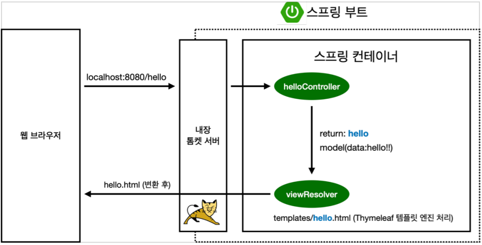

# Welcome Page 만들기

## index.html 파일 생성

`resources/static/index.html` 위치에 생성한다.

```html
<!DOCTYPE HTML>

<html>
    <head>
        <title>Hello</title>
        <meta http-equiv="Content-Type" content="text/html; charset=UTF-8" />
    </head>
    <body>
        Hello
        <a href="/hello">hello</a>
    </body>
</html>
```

- 스프링부트는 static/index.html 을 올려두면 Welcome page 기능을 기본으로 제공한다.

## thymeleaf 템플릿 엔진을 이용하여 hello 페이지 제작

### 컨트롤러 생성

```java
@Controller
public class HelloController { 
    @GetMapping("hello")
    public String hello(Model model) {
        model.addAttribute("data", "hello!!");
    return "hello";
    }
}
```

### hello.html 파일 생성

```html
<!DOCTYPE HTML>
<html xmlns:th="http://www.thymeleaf.org">
    <head>
        <title>Hello</title>
        <meta http-equiv="Content-Type" content="text/html; charset=UTF-8" />
    </head>
    <body>
        <p th:text="'안녕하세요. ' + ${data}" >안녕하세요. 손님</p>
    </body>
</html>
```

### 동작환경



- 컨트롤러에서 리턴 값으로 문자를 반환하면 뷰 리졸버가 화면을 찾아서 처리한다.  
```
  스프링부트 템플릿엔진 기본 viewName 매핑
  resource:templates/ + {ViewName} + .html   
```